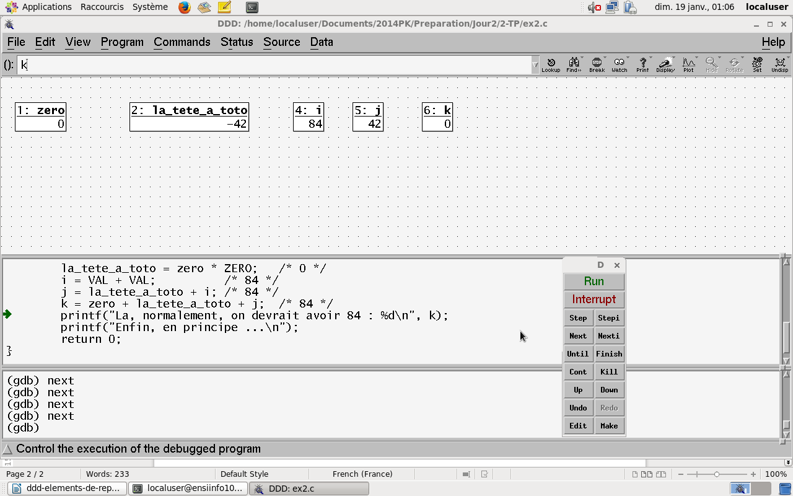

#### Corrigé du fichier Makefile

```make
# Compléter le Makefile effectuant les opérations suivantes :
# - Génération de l'exécutable : <nomexecutable>
# - <nomexecutable> : avec options de compilation standards et mode débogage pour utilisation de ddd/gdb et valgrind
# - Génération du fichier préprocesseur: <nomexecutable>_preprocesseur.txt
# - Règle clean : supprimer les fichiers .o ainsi que l'exécutable et le fichier préprocesseur générés 
CC=gcc
CFLAGS=-std=c99 -Wall -Wextra -g
LDFLAGS=
# Option -E pour géréner le fichier de sortie préprocesseur
PREFLAGS=-E
EXEC=debogage-exo2

all: $(EXEC) $(EXEC)_preprocesseur.txt

# Générer le fichier de sortie préprocesseur : <nomexecutable>_preprocesseur.txt
$(EXEC)_preprocesseur.txt: $(EXEC).c
	$(CC) -o $@ $^ $(CFLAGS) $(PREFLAGS) $(LDFLAGS)

$(EXEC): $(EXEC).c
	$(CC) -o $@ $^ $(CFLAGS) $(LDFLAGS)

.PHONY: clean
clean:
	rm -f *~ *.o $(EXEC) $(EXEC)_preprocesseur.txt

```

#### Corrigé du fichier debogage-exo2.c

```c
#include <stdio.h>

#define VAL 42
#define ZERO VAL-42

int main()
{
    int zero, la_tete_a_toto, i, j, k;
    printf("VAL=%d\n", VAL);
    printf("ZERO=%d\n", ZERO);
    zero = ZERO;					/* 0 */
    la_tete_a_toto = zero * ZERO;	/* 0 */
    i = VAL + VAL;					/* 84 */
    j = la_tete_a_toto + i;			/* 84 */
    k = zero + la_tete_a_toto + j;	/* 84 */
    printf("La, normalement, on devrait avoir 84 : %d\n", k);
    printf("Enfin, en principe ...\n");
    return 0;
}


```


# Correction debogage-exo2

Résumé : erreur d’interprétation liée aux macros.

## Warnings compilation

RAS, pas d'erreur.

_MAIS_ : lorsque vous écrivez des macros, il y a une option du compilateur à utiliser pour vérifier le résultat obtenu après l’étape de préprocesseur : option `-E` => à utiliser systématiquement dès qu'il y a des macros pour comprendre vraiment ce qui se passe.

    gcc -o debogage-exo2-preprocesseur.txt debogage-exo2.c -std=c99 -Wall -Wextra -g -E

Le fichier debogage-exo2-preprocesseur.txt généré par la commande ci-dessus contient :

```c
int main()
{
    int zero, la_tete_a_toto, i, j, k;
    printf("VAL=%d\n", 42);
    printf("ZERO=%d\n", 42 -42);
    zero = 42 -42;
    la_tete_a_toto = zero * 42 -42;  //--> priorité de l'opérateur * par rapport à -
    i = 42 + 42;
    j = la_tete_a_toto + i;
    k = zero + la_tete_a_toto + j;
    printf("La, normalement, on devrait avoir 84 : %d\n", k);
    printf("Enfin, en principe ...\n");
    return 0;
}
```

Le bug est ici lié aux priorités des opérateurs en C :

```c
la_tete_a_toto = zero * 42 -42;
```

L'opérateur `*` étant plus prioritaire que l'opérateur `-`, le code ci-dessus est équivalent à :

```c
la_tete_a_toto = (zero * 42) - 42;
```

## Valgrind

RAS, aucune erreur

## gdb/ddd 

A l'aide d'un debugger, on peut voir ligne par ligne que les résultats ne sont pas ceux attendus.
Par contre, ça n'aide pas vraiment à comprendre pourquoi ici.

    gcc debogage-exo2.c -o debogage-exo2 -std=c99 -Wall -Wextra –g
    ddd ./ debogage-exo2
	   graph display zero
	   graph display la_tete_a_toto
	   graph display i
	   graph display j
	   graph display k



## Conclusion

Le problème vient du fait que l’opérateur `*` est plus prioritaire que l’opérateur `–` (cf. table complète des priorités dans le poly, 7.4.2), c’est-à-dire que l’opération qu’il effectue est réalisée en premier. Le problème est masqué par les macros. Il est dévoilé facilement par l’option de compilation `gcc  -E` qui permet de voir le résultat des macros dans le fichier source à l’étape du préprocesseur.

[Retour au sommaire](?)