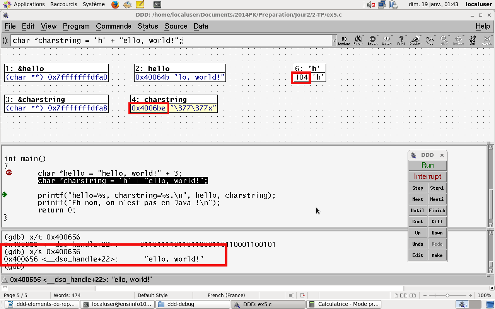

#### Corrigé du fichier Makefile

```make
# Compléter le Makefile effectuant les opérations suivantes :
# - Génération de l'exécutable : <nomexecutable>
# - <nomexecutable> : avec options de compilation standards et mode débogage pour utilisation de ddd/gdb et valgrind
# - Règle clean : supprimer les fichiers .o et l'exécutable généré 
CC=gcc
CFLAGS=-std=c99 -Wall -Wextra -g
LDFLAGS=
EXEC=debogage-exo8

all: $(EXEC)

$(EXEC): $(EXEC).c
	$(CC) -o $@ $^ $(CFLAGS) $(LDFLAGS)

.PHONY: clean
clean:
	rm -f *~ *.o $(EXEC)

```

#### Corrigé du fichier debogage-exo8.c

```c
#include <stdio.h>

int main()
{
	/*
	  L'adresse de hello est égale à l'adresse de la zone
	  mémoire de la chaine "hello, world!" décalée de 3
	  caractères.
	*/
	char *hello = "hello, world!" + 3;
	/*
	   L'adresse de charstring est égale à l'adresse de la zone
	   mémoire de la chaine "ello, world!" décalée la valeur ascii
	   du caractère 'h'
	*/
	char *charstring = 'h' + "ello, world!";

	printf("hello=%s, charstring=%s.\n", hello, charstring);
	printf("Eh non, on n'est pas en Java !\n");
	return 0;
}


```


# Correction debogage-exo8

### Résumé : Une histoire de décalage d’adresse

## Compilation

    gcc -o debogage-exo8 debogage-exo8.c -std=c99 -Wall -Wextra -g

    debogage-exo8.c:26:25: warning: adding 'int' to a string does not append to the string
        [-Wstring-plus-int]
            char *charstring = 'h' + "ello, world!";
                            ~~~~^~~~~~~~~~~~~~~~
    debogage-exo8.c:26:25: note: use array indexing to silence this warning
    1 warning generated.

## Valgrind
RAS, pas d'erreur

## gdb/ddd

Permet de mettre sur la voie de ce qui se passe mais pas facile de démontrer exactement le phénomène.

    gcc -o debogage-exo8 debogage-exo8.c -std=c99 -Wall -Wextra –g
    ddd ./ debogage-exo8
	   graph display hello
	   graph display charstring
	   graph display 'h'



## Conclusion

Le caractère `'h'` correspond au code ascii 104.
`'h'` -> 104. On convertit 104 en hexa : 68
Calcul en hexa : adresse de `charstring` – 68, exemple : 4006BE – 68 = 40064E
On affiche le contenu de l'adresse 400656 : x/s 0x400656, on trouve `"ello, world"` (celui de la ligne : `char *charstring = 'h' + "ello, world!";`).
On démontre ainsi le décalage d'adresse effectué :
`charstring = 'h' + "ello, world!"` => `charstring` prend en fait l’adresse résultant de l’addition de :

* adresse de la case mémoire où est stockée la chaine `"ello, world"` ;
* valeur ascii du caractère `'h'` : 104.

[Retour au sommaire](?)