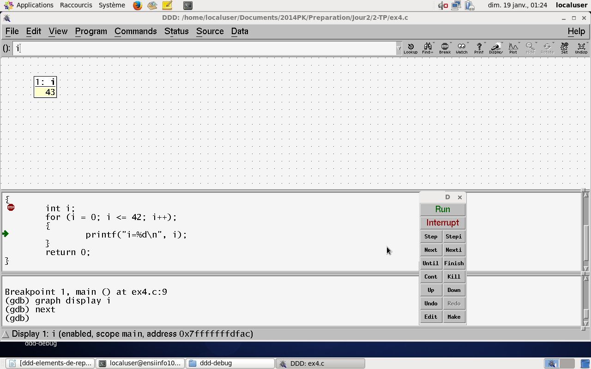

#### Corrigé du fichier Makefile

```make
# Compléter le Makefile effectuant les opérations suivantes :
# - Génération de l'exécutable : <nomexecutable>
# - <nomexecutable> : avec options de compilation standards et mode débogage pour utilisation de ddd/gdb et valgrind
# - Règle clean : supprimer les fichiers .o et l'exécutable généré
CC=gcc
CFLAGS=-std=c99 -Wall -Wextra -g
LDFLAGS=
EXEC=debogage-exo7

all: $(EXEC)

$(EXEC): $(EXEC).c
	$(CC) -o $@ $^ $(CFLAGS) $(LDFLAGS)

.PHONY: clean
clean:
	rm -f *~ *.o $(EXEC)

.PHONY: pouetpouet
pouetpouet:
	echo "Ce Makefile ne fait rien, c'est à vous de le compléter!"

```

#### Corrigé du fichier debogage-exo7.c

```c
#include <stdio.h>

int main()
{
    int i;
    /*
      Le ";" à la fin de la boucle for termine cette boucle
      qui n'effectue donc aucun traitement, si ce n'est i++.
      A la sortie de la boucle, i vaut 43.
    */
    for (i = 0; i <= 42; i++);
    {
	/*
	  Ce printf est en dehors de la boucle.
	  Il n'est donc exécuté qu'une seule fois.
	*/
	printf("i=%d\n", i);
    }
    return 0;
}


```


# Correction debogage-exo7

Résumé : Une boucle `for` avec un `;` à la fin, ça craint.

## Compilation

Warning explicite indiquant la présence d’un `;` en fin de boucle for

    gcc -o debogage-exo7 debogage-exo7.c -std=c99 -Wall -Wextra -g

    debogage-exo7.c:9:27: warning: for loop has empty body [-Wempty-body]
            for (i = 0; i <= 42; i++);
                                 ^
    debogage-exo7.c:9:27: note: put the semicolon on a separate line to silence this warning
    1 warning generated.

## Valgrind

RAS, pas d'erreur

## gdb/ddd

Met en évidence également que la boucle s'exécute _à vide_ et que `i` passe directement à `43` au premier passage sur la ligne `for`.

    gcc -o debogage-exo7 debogage-exo7.c -std=c99 -Wall -Wextra –g
    ddd ./debogage-exo7
    // Mettre un point d’arrêt « break » avat la boucle for
    graph display i
    // Exécuter en mode pas à pas (commande « step »)



## Conclusion

Le point-virgule à la fin du `for` termine le code lié à la boucle `for`. Le point-virgule représente ici une instruction vide qui va être exécutée à chaque tour de boucle `for`. Le code entre `{}` qui suit ne fait pas partie de la boucle. Il n’est donc interprété qu’une seule fois après la fin de cette boucle très particulière, comme un bloc de code C normal.

[Retour au sommaire](?)